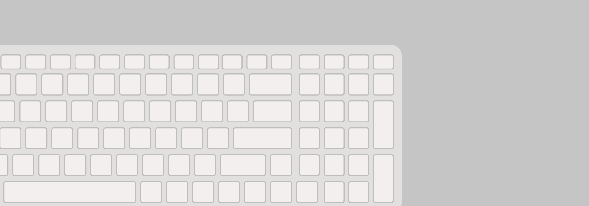

# data (auto-generated)

## Title



Hello, world!


## Title 2

Hello, world!

Second paragraph.


## Тестовая страница с кодом

Текст какой-то.

### Подзаголовок

```python
x = input()
```

```python
y = input()
```

Тут комментарий.

<details>
<summary>Summary</summary>

````md
```python
a = int(input())
k = 0
for i in range(1, a):
    if a % i == 0:
        print(i, end=" ")
        k += 1
print(a)
if k == 1:
    print("ПРОСТОЕ")
else:
    print("НЕТ")
```
````

**Жирный текст.**

</details>

Текст.

```
a = list("Пример")
print(a)
for i in range(len(a)):
    if a[i] == "р":
        a[i] = "л"
print("".join(a))
```

Код:

    a = list("Пример")
    print(a)
    for i in range(len(a)):
        if a[i] == "р":
            a[i] = "л"
    print("".join(a))

Еще код

    a = list("Пример")
    print(a)
    for i in range(len(a)):
        if a[i] == "р":
            a[i] = "л"
    print("".join(a))
